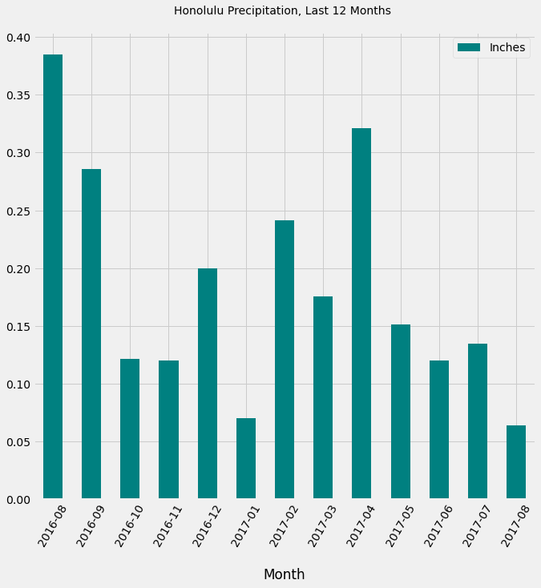

# SQLalchemy_climate_project

The purpose of this project was to practice extracting and manipulating data from a relational database using python's SQLalchemy tools.  The dataset includes information about Hawaii's climate which I extracted, cleaned, jsonified and served to a web app from which I could then do various analyses and visualizations such as the following:

